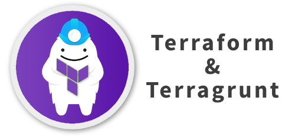
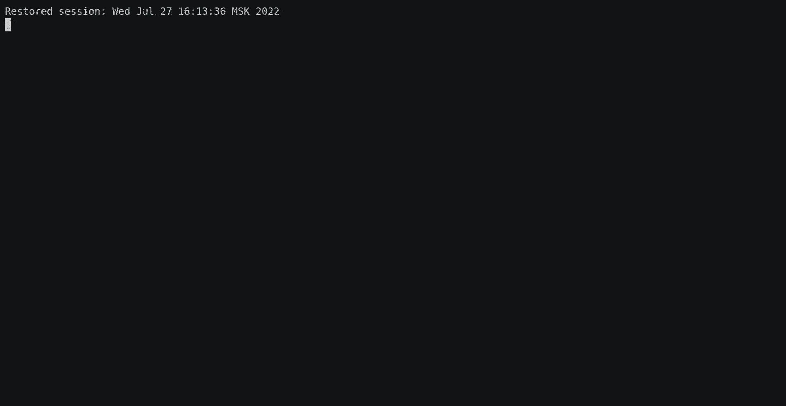

# Infrastructure as Code starter kit
Multi-Cloud Infrastructure as Code boilerplate repository

## Motivation
Every time when you start a new IaC project you have to answer a lot of
questions - how to organize your code files? how to manage state-files?
do I have to run terraform locally or do I need a CI server for that?
There are no standardized way to organize your code.
This repository serves as a starting point for your Infrastructure as Code
based on [Terraform](https://terraform.io) and [Terragrunt](https://terragrunt.gruntwork.io/).

No matter what cloud provider you are using Amazon Web Services or Google Cloud Platform,
you will keep all of your code files in one place.

> In fact this is not a real cloud-agnostic solution,
because the code for different cloud providers is various due to different
resources and their specifics. Anyway you still be able to use the same syntax,
constructions and code style.

## Features
* Use with any part of infrastructure
* Cover all the services or only the one
* Easiest way to start your IaC project from scratch
* Create a new AWS or GCP account from template
* Minimum requirements - you only need docker installed on your machine
* CI/CD pipelines
* Multi-account terraform state

## Structure
* [live](live/README.md) *configuration files mirroring your live infrastructure*
    * [live/aws-acme](live/aws-acme/README.md) *AWS account #1*
        * [live/aws-acme/global](live/aws-acme/global/README.md) *region-independent services*
        * [live/aws-acme/us-east-1](live/aws-acme/us-east-1/README.md) *region specific*
    * [live/gcp-foobar](#nonexistent) *Google account #1*
        * [live/gcp-foobar/global](#nonexistent) *region-independent services*
        * [live/gcp-foobar/us-west1](#nonexistent) *region specific*
* [modules](modules/README.md) *community modules, infrastructure micro-modules*
    * [modules/aws-data](modules/aws-data/README.md) *example of AWS specific module*
    * [modules/gcp-data](#nonexistent) *example of Google specific module*

## Quick start

* Check out the repository
* Configure *terragrunt.hcl* files for correct settings
* Run once *make build* to build docker image with required utilities
* Run *make plan* every time to evaluate terraform intentions

## Terraform best practices
* Manipulate state only through Terraform/Terragrunt commands, do not edit JSON directly
* Always set up a shared remote storage
* Use state locking
* Back up your state file
* Use one state per environment
* Host Terraform/Terragrunt scripts in git repository
* Use continuous integration for Terraform code
* Apply Terraform code only through CD pipeline

## Makefile options
* `make newaws <account-name>`. Creating a new account dir with AWS-specific setting
* `make newgcp <account-name>`. Creating a new account dir with Google-specific settings
* `make newmod <module-name>`. Creating a new infra-module directory

## Feedback
[Suggestions and improvements](https://github.com/exdial/iac-starter-kit/issues)
